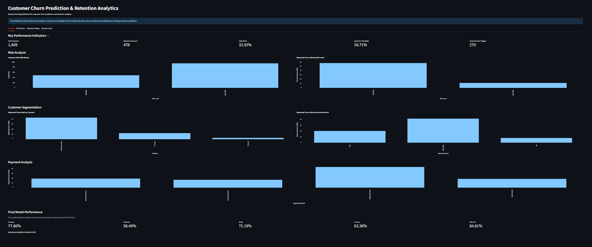

# Customer Churn Prediction and Retention Analytics Using Machine Learning

An end-to-end machine learning project that predicts customer churn risk, identifies important churn-related patterns, segments customers by risk, and translates model predictions into retention and business-impact insights.

---

## Project Overview

Customer churn is a major business problem for subscription-based companies.

The objective of this project is to build a machine learning workflow that can:

- Understand customer churn patterns
- Predict the probability that a customer will churn
- Identify high-risk customers
- Compare multiple machine learning models
- Optimize the classification threshold for a retention-focused use case
- Explain model predictions
- Segment customers according to predicted churn risk
- Estimate the potential business impact of a retention campaign
- Provide an interactive Streamlit dashboard for customer-level analysis

The project uses the IBM Telco Customer Churn dataset.

---

## Business Problem

A telecom company wants to identify customers who may be at higher risk of leaving the service.

Instead of treating every customer equally, the company could use a churn prediction model to prioritize customers for further retention analysis.

The key business questions are:

1. Which customers have higher predicted churn risk?
2. Which customer characteristics are associated with churn?
3. How well can machine learning distinguish churners from non-churners?
4. How should the classification threshold be selected for a retention use case?
5. Which customer segments should be investigated for retention opportunities?
6. What would a hypothetical retention campaign look like financially?

---

## Dataset

The project uses the IBM Telco Customer Churn dataset.

The original dataset contains:

- 7,043 customers
- 33 original columns
- Customer demographic information
- Service information
- Contract information
- Billing information
- Customer lifetime value information
- Churn information

The target variable is:

`Churn Value`

where:

- `0` = Customer did not churn
- `1` = Customer churned

---

## Data Preparation

Several data-quality checks and transformations were performed.

### Missing Values

The `Total Charges` column initially contained 11 blank values.

Investigation showed that these records had:

- `Tenure Months = 0`
- `Churn Value = 0`

The values were converted to numeric format and the 11 missing values were treated as zero.

### Duplicate Customers

No duplicate `CustomerID` values were found.

No duplicate full rows were found.

---

## Leakage Prevention

Several variables were excluded from the machine learning model because they were not appropriate prediction-time features.

### Churn Reason

`Churn Reason` describes why a customer already churned.

Therefore, it is outcome-derived information and would not be available when predicting whether an active customer will churn.

It was excluded to prevent target leakage.

### Churn Score

`Churn Score` was excluded because it is itself a predictive churn score and presents a leakage risk when building an independent churn model.

### Churn Label

`Churn Label` represents another form of the churn outcome and was excluded because `Churn Value` was selected as the target.

### Geographic Identifiers

The following geographic/customer identifiers were excluded from the base model:

- CustomerID
- City
- Zip Code
- Latitude
- Longitude
- Lat Long

---

## Exploratory Data Analysis

Exploratory analysis was used to understand associations between customer characteristics and observed churn.

### Contract

Observed churn rate:

| Contract | Churn Rate |
|---|---:|
| Month-to-month | 42.71% |
| One year | 11.27% |
| Two year | 2.83% |

Month-to-month customers showed a substantially higher observed churn rate in this dataset.

### Tenure

Observed churn was higher among customers with shorter tenure.

| Tenure Group | Churn Rate |
|---|---:|
| 0–12 months | 47.44% |
| 13–24 months | 28.71% |
| 25–36 months | 21.63% |
| 37–48 months | 19.03% |
| 49–60 months | 14.42% |
| 61–72 months | 6.61% |

### Internet Service

| Internet Service | Churn Rate |
|---|---:|
| DSL | 18.96% |
| Fiber optic | 41.89% |
| No internet service | 7.40% |

### Payment Method

Electronic check customers showed a higher observed churn rate than the other payment-method groups in this dataset.

### Customer Support and Security Services

Customers without services such as online security and technical support also showed higher observed churn rates.

These relationships are observational associations and should not be interpreted as causal effects without further experimentation.

---

## Machine Learning Approach

The problem was treated as a supervised binary classification task.

### Target

`Churn Value`

### Features

The model used customer:

- Demographic characteristics
- Service characteristics
- Contract information
- Billing information
- Tenure
- Monthly charges
- Total charges
- CLTV

---

## Train/Test Split

The dataset was divided into:

- 80% training data
- 20% testing data

Stratified sampling was used to preserve the churn/non-churn class distribution.

The test set was kept separate for final evaluation.

---

## Preprocessing

Numerical features were standardized using:

`StandardScaler`

Categorical features were transformed using:

`OneHotEncoder`

with:

`handle_unknown="ignore"`

The preprocessing and model were combined into a scikit-learn pipeline for the final tuning workflow.

---

## Models Evaluated

Three classification models were evaluated:

1. Logistic Regression
2. Random Forest
3. XGBoost

A majority-class Dummy Classifier was also used as a baseline.

---

## Baseline

The majority-class baseline achieved:

**Accuracy = 73.46%**

However, it identified no churners:

- Recall = 0%
- F1 = 0

This demonstrates why accuracy alone is not sufficient for this problem.

---

## Model Comparison

Initial test-set results at the default classification threshold of 0.50:

| Model | Accuracy | Precision | Recall | F1 | ROC-AUC |
|---|---:|---:|---:|---:|---:|
| Logistic Regression | 80.20% | 64.26% | 57.22% | 60.54% | 84.89% |
| Random Forest | 79.42% | 63.73% | 52.14% | 57.35% | 83.96% |
| XGBoost | 79.35% | 63.01% | 53.74% | 58.01% | 84.85% |

Logistic Regression was used for the final risk-scoring workflow because it provided a useful combination of predictive performance and interpretability.

---

## Hyperparameter Tuning

Logistic Regression was tuned using cross-validation.

The final properly pipelined tuning process selected:

`C = 10`

The best cross-validation F1 score was approximately:

`0.624`

The preprocessing step was included inside the cross-validation pipeline to avoid preprocessing leakage between validation folds.

---

## Threshold Optimization

The default classification threshold of 0.50 is not necessarily the best threshold for a retention-focused application.

A lower threshold can identify more potential churners, although this also increases the number of customers flagged for intervention.

Cross-validated training probabilities were used to evaluate different thresholds.

The selected threshold was:

**0.35**

At this threshold, the cross-validated F1 score was approximately:

**0.647**

The threshold was selected using the training data through cross-validation and then evaluated once on the held-out test set.

---

## Final Model Performance

Using the Logistic Regression model with a probability threshold of 0.35:

| Metric | Test Result |
|---|---:|
| Accuracy | 77.86% |
| Precision | 56.49% |
| Recall | 72.19% |
| F1 Score | 63.38% |
| ROC-AUC | 84.81% |

### Confusion Matrix

| | Predicted No Churn | Predicted Churn |
|---|---:|---:|
| Actual No Churn | 827 | 208 |
| Actual Churn | 104 | 270 |

Therefore:

- True Negatives = 827
- False Positives = 208
- False Negatives = 104
- True Positives = 270

The threshold change increased recall from approximately 56.95% at the default threshold to 72.19%.

This means the model identified more of the churners in the held-out test set, while precision and accuracy decreased.

---

## Why Recall Matters

In a retention use case, missing a customer who eventually churns can be costly because that customer receives no retention intervention.

Therefore, recall is an important metric.

However, maximizing recall alone would result in more customers being flagged.

The threshold therefore represents a trade-off between:

- Identifying more potential churners
- Avoiding unnecessary retention interventions

The final threshold should ultimately be determined using real business costs and benefits.

---

## Explainability

Two approaches were used to understand model behavior.

### Logistic Regression Coefficients

Logistic Regression coefficients were examined to understand the direction and magnitude of model associations.

Odds ratios were also calculated using:

`exp(coefficient)`

An odds ratio greater than 1 indicates higher modeled odds, while an odds ratio below 1 indicates lower modeled odds, holding the other modeled variables constant.

These are model associations and should not be interpreted as causal effects.

### SHAP

SHAP was used with the XGBoost model to investigate feature contributions.

Important global SHAP features included:

- Month-to-month contract
- Dependents
- Tenure
- Monthly Charges
- Online Security
- Fiber optic internet service
- Technical Support
- Total Charges
- Electronic Check

SHAP was also used to inspect an individual high-risk customer prediction.

SHAP explanations describe model behavior rather than proving causality.

---

## Customer Risk Segmentation

The final Logistic Regression model was used to create customer risk segments using the 0.35 probability threshold.

Results on the held-out test dataset:

- Total customers: **1,409**
- High-risk customers: **478**
- High-risk percentage: **33.92%**
- Actual churners flagged: **270**

Observed churn rates within the test-set risk groups were:

- High Risk: **56.49%**
- Lower Risk: **11.17%**

These are observed historical outcomes within the held-out test dataset and should not be interpreted as guaranteed future churn rates.

---

## Business Impact Scenario

A hypothetical retention campaign was created to demonstrate how model predictions could be connected to business decisions.

Illustrative assumptions:

- Campaign cost per flagged customer = **500**
- Retained customer value = **5,000**

For the 478 flagged customers:

- Campaign cost = **239,000**
- Actual churners flagged = **270**

The calculated break-even retention rate was:

**17.70%**

Under these illustrative assumptions, approximately 17.70% of the flagged actual churners would need to be retained to recover the assumed campaign cost.

These figures are scenario estimates rather than realized financial results.

---

## Retention Strategy

The analysis suggests several areas that could be investigated through controlled retention experiments:

| Customer Signal | Potential Action |
|---|---|
| Month-to-month contract | Test contract-renewal incentives |
| Short tenure | Strengthen early customer onboarding |
| Fiber optic | Investigate service experience |
| No online security | Test education, trial, or bundle options |
| No technical support | Test proactive support |
| Electronic check | Test alternative payment options |
| High predicted churn | Prioritize targeted retention outreach |

These are hypotheses rather than causal conclusions.

A controlled experiment such as an A/B test would be required to determine whether a particular intervention actually reduces churn.

---

## Streamlit Dashboard

The project includes an interactive Streamlit dashboard.

### Overview

Provides:

- Customer KPIs
- Risk distribution
- Observed churn by risk level
- Contract analysis
- Internet-service analysis
- Payment analysis
- Final model metrics

### Risk Explorer

Allows users to:

- Filter by risk level
- Filter by contract
- Filter by internet service
- Filter by payment method
- Set minimum churn probability
- Search by CustomerID
- Inspect customer-level predictions
- Download filtered customers

### Retention Strategy

Provides potential retention actions based on observed customer patterns and model risk.

### Business Impact

Provides:

- Campaign assumptions
- Break-even analysis
- Retention success scenarios
- Estimated net benefit visualization

---

## Project Structure

```text
Customer-Churn-Prediction/
│
├── dashboard/
│   └── app.py
│
├── data/
│   ├── Telco_customer_churn.xlsx
│   └── customer_churn_predictions.csv
│
├── notebooks/
│   └── 01_Data_Understanding.ipynb
│
├── reports/
│
├── README.md
│
└── requirements.txt


## Dashboard Preview

